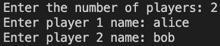
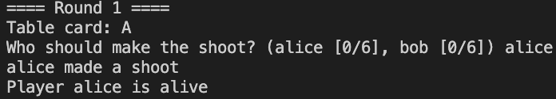
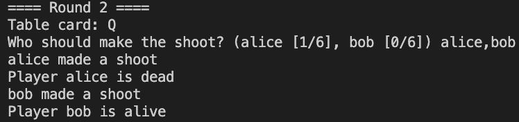

# Simulator for in-person [Liar's Bar](https://liarsbar.wiki/)

## Overview

This repository provides the code support for playing the game liar's bar in person.

## Setup

This code requires python > 3 and has been tested on python 3.8.1

## Usage
from `[parent_dir_of_liars_bar]/liars_bar]`, run the following command:

```shell
python liars_bar.py
```

## Instructions
Upon launching the program, the simulator will guide you through each step of the game.

### Initial Setup
Enter the number of players and each player's name.



### Player Turns
- For each iteration, you'll need to enter the name of the player taking a shot.
- Example:
  


### Ghost Card Option
- If your game variation includes a "ghost card" that allows multiple players to take shots in a single round, enter all relevant players' names, separated by commas.

- Example:



# Good luck on the table!
Enjoy the game. May the best player win!
